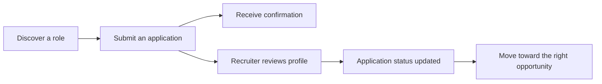

<div align="center">

# Shree Shyam Talent Solutions

### A focused recruitment platform for better matches between people and opportunity.

[](https://nextjs.org/)
[](https://react.dev/)
[](https://www.typescriptlang.org/)
[](https://tailwindcss.com/)

[Explore the experience](#key-capabilities) | [Run locally](#quick-start) | [See the workflow](#candidate-workflow)

</div>

## Overview

Shree Shyam Talent Solutions is a full-stack recruitment website for candidates, employers, and internal recruiters. Candidates can discover roles, submit their CV, and send inquiries. Recruiters can review applications, manage statuses, inspect analytics, and export candidate data from a private dashboard.

The experience is designed to make hiring feel clear and deliberate: candidates get a simple path from discovery to application, while recruiters get the information and tools needed to keep every application moving.

## What It Brings Together

- **For candidates:** Browse curated opportunities, review role details, submit a CV, and receive confirmation by email.
- **For recruiters:** Review candidate profiles, search and filter applications, update progress, and understand hiring activity through dashboard analytics.
- **For the agency:** Present services professionally, capture contact inquiries, and keep candidate communication consistent across the recruitment journey.

## Key Capabilities

| Candidate experience | Recruitment operations |
| --- | --- |
| Searchable job listings and job details | Admin login and private dashboard |
| Validated CV upload for PDF, DOC, and DOCX files | Candidate search, filtering, and status updates |
| 5 MB upload limit and file validation | Candidate records and CSV export |
| Contact and application workflows | Automated candidate tracking |
| Responsive pages for mobile and desktop | Automated email notifications through Nodemailer |

## Product Experience

### A clear path for candidates

The public experience is built around discovery and trust. Candidates can browse available roles, open a dedicated job detail page, understand the opportunity before applying, and submit their CV through a focused form. Contact and legal pages provide the supporting information expected from a professional recruitment service.

### Practical tools for recruiters

The private admin area turns incoming applications into an organized workflow. Recruiters can search and filter candidate records, review contact and professional details, update application status, remove records when needed, and use dashboard analytics to understand the current candidate pipeline.

### Consistent communication

Candidate submissions and contact inquiries trigger structured email workflows. Candidates receive confirmation after submitting their information, while the recruitment team receives notifications that keep new activity visible without relying on manual follow-up.

## Main Experiences

| Experience | Description |
| --- | --- |
| Homepage | Introduces the agency, its services, and the value it provides to candidates and employers. |
| Jobs | Lets candidates search roles by title, company, location, and job type. |
| Job details | Presents responsibilities, requirements, benefits, and the next step toward applying. |
| Upload CV | Collects candidate information and validates supported file types and upload size. |
| Contact | Captures inquiries and sends confirmation and internal notification emails. |
| Admin dashboard | Provides application review, status management, filtering, and analytics. |

## Candidate Workflow



## Quick Start

### Requirements

- Node.js 20+
- SMTP credentials for application email

```bash
git clone <repository-url>
cd recruitment-platform
npm install
npm run dev
```

Open [http://localhost:3000](http://localhost:3000) after the development server starts. The main experience includes the homepage, job listings, job details, services, contact, and CV submission pages, with recruiter tools available through the admin area.

<details>
<summary>Environment variables</summary>

Create `.env.local` in the project root:

```env
ADMIN_LOGIN_EMAIL=admin@example.com
ADMIN_LOGIN_PASSWORD=replace-with-a-strong-password

SMTP_HOST=smtp.gmail.com
SMTP_PORT=587
SMTP_USER=your-email@example.com
SMTP_PASSWORD=your-app-password

ADMIN_EMAIL=admin@example.com
NEXT_PUBLIC_SITE_URL=http://localhost:3000
```

</details>

## Useful Commands

```bash
npm run dev      # Start development
npm run lint     # Run ESLint
npm run build    # Create a production build
npm run start    # Serve the production build
```
